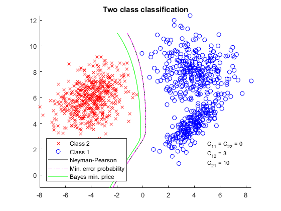
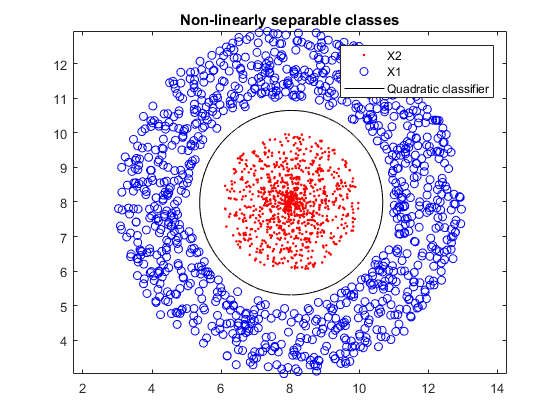
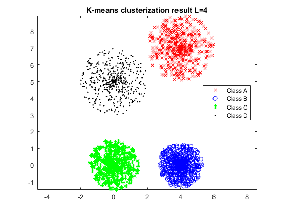
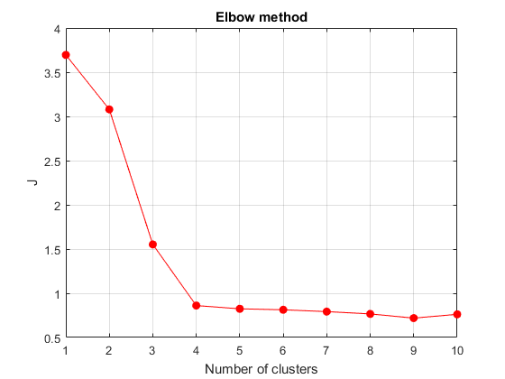

# Pattern Recognition algorithms & methods

Pattern Recognition algorithms & methods:

### Classifiers
- Bayes minimal classification error
- Bayes minimal classification cost 
- Neyman-Pearson
- Linear classifiers: Desired Output, II iterative method

### Wald's sequential test

### Clustering
- Kmeans
- Square error

Some of the classification and clusterization results are shown below.
Directory named 'images' contains all results.

#### Some classification results
Hypothesis tests            |  Quadratic classifier
:-------------------------:|:-------------------------:
  |  

#### Some clusterization results
K-means result             |   Elbow method applied to K-means
:-------------------------:|:-------------------------:
  |  
